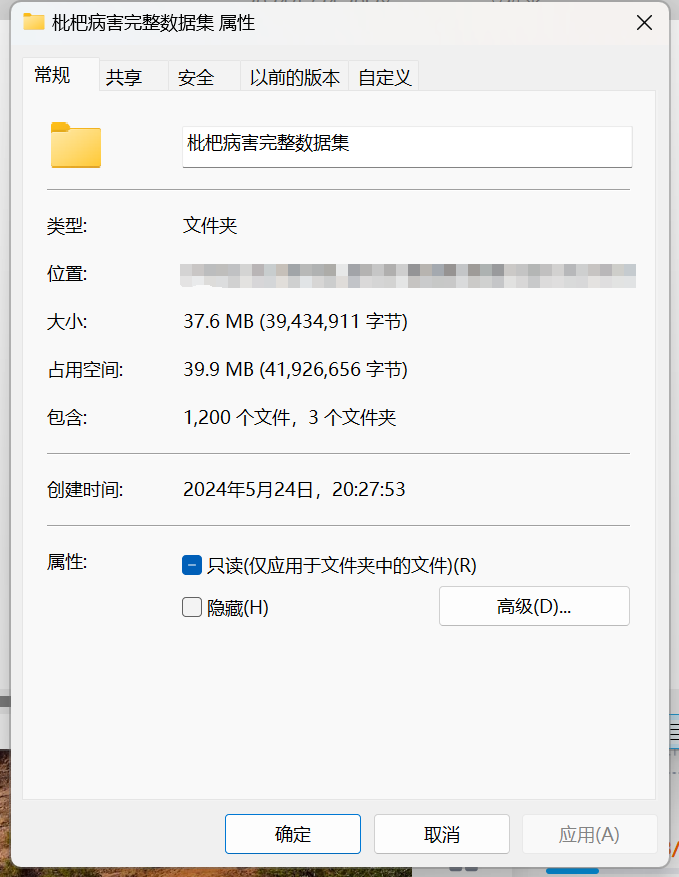
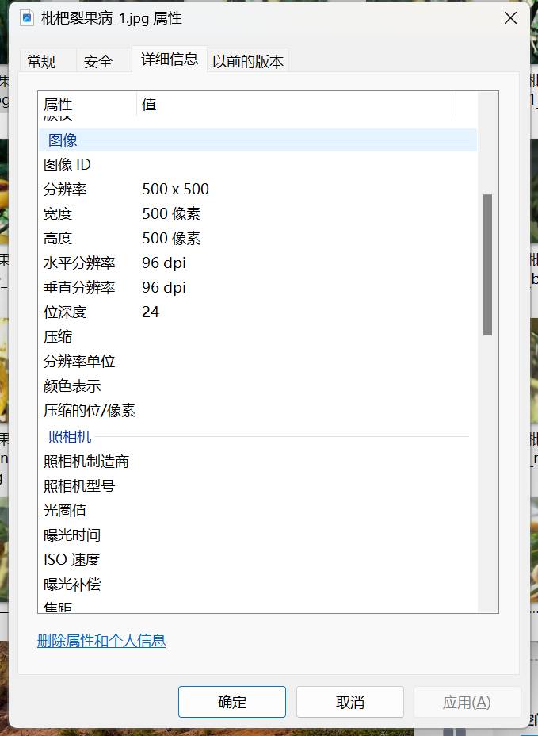

# Peach Fruit Disease Image Classification Dataset (Complex Background)

This dataset provides detailed information on the folders containing images of peaches under normal conditions, Peach scab disease, and Peach splitting disease. The number of images in each subfolder is as follows:
- Normal peaches: 400
- Scab disease peaches: 400
- Splitting disease peaches: 400

The total number of images in all subfolders is 1200. The dataset includes image examples for consultation. To ask questions, simply add your question directly; there is no need for friend verification. You can send a message to me without needing my approval. I will be able to see it.

When searching for me, please send your questions and intention clearly at once. I will reply to you, sometimes I am busy, so you can describe your problem and intention when I have free time. I will also reply to you when I have free time without any formalities, which makes our communication more efficient.

If I forget to reply or if you are impatient, you can also send a text message or call.

## Image

Here is a pay link on Stripe ( https://buy.stripe.com/3cs8yP7sY87d0vu9AB ). Please contact me lonlonago@foxmail.com after funding $89, and I will send you a complete data files , thank you!

